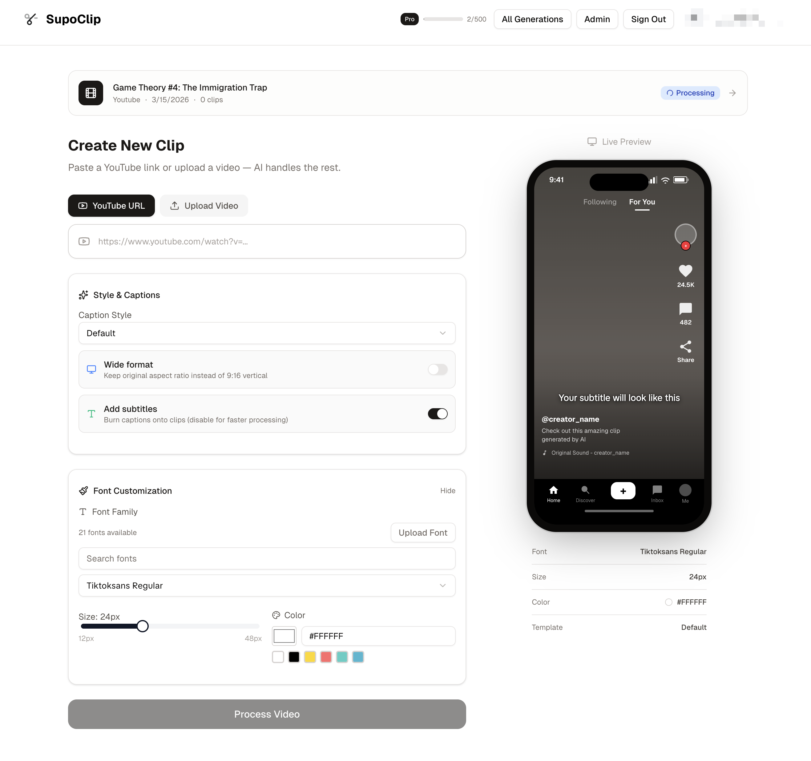

# Fuck OpusClip.

Open-source AI clipper. Self-host it, no watermarks, no monthly bill.

<p align="center">
  <a href="https://www.supoclip.com">
    
  </a>
</p>

Hosted version: [supoclip.com](https://www.supoclip.com)

## Run it

**Needs:** Docker, [AssemblyAI](https://www.assemblyai.com/) key, and either Ollama or a cloud LLM key.

```bash
git clone https://github.com/your-username/supoclip.git
cd supoclip
cp .env.example .env   # add ASSEMBLY_AI_API_KEY
./start.sh
```

Or: `docker-compose up -d --build`

Open http://localhost:3000 — local mode skips sign-in.

| Service | URL |
|---------|-----|
| App | http://localhost:3000 |
| API | http://localhost:8000 |
| API docs | http://localhost:8000/docs |

## `.env` (minimum)

```env
ASSEMBLY_AI_API_KEY=your_key

# Default: local Ollama (no cloud key). Pull the model or use Settings → model picker.
LLM=ollama:llama3.2:3b
OLLAMA_BASE_URL=http://localhost:11434/v1
```

Docker on Mac/Windows talking to host Ollama:

```env
OLLAMA_BASE_URL=http://host.docker.internal:11434/v1
```

Cloud instead of Ollama — pick one and set its key:

```env
# LLM=google-gla:gemini-3-flash-preview
# GOOGLE_API_KEY=...

# LLM=openai:gpt-5.2
# OPENAI_API_KEY=...
```

Full list: [`.env.example`](.env.example). More detail: [`docs/setup.md`](docs/setup.md).

## Common fixes

- **Stuck on queued** — `docker-compose logs -f worker`
- **LLM errors** — Ollama running? Model pulled? (`ollama pull llama3.2:3b`)
- **Changed `.env`** — `docker-compose up -d --build`
- **Everything else** — [`docs/troubleshooting.md`](docs/troubleshooting.md)

## Tests

```bash
make test
```

## Docs

[`docs/`](docs/README.md) — setup, config, architecture, API, development.

## License

AGPL-3.0 — see [LICENSE](LICENSE).
